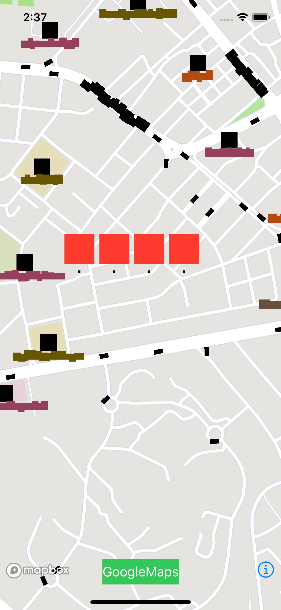

# Mapbox-GoogleMaps

This repository contains minimal working example for reproducing this bug:

## Setting up the project:
1. Install dependencies with `pod install`
2. Provide Mapbox access token and Google Maps API Key in `AppDelegate.swift`

## Steps to reproduce:
1. Run the app
2. Tap green GoogleMaps button to present view controller with Google Maps map
3. Move Google Maps map a bit - pan, zoom etc.
4. Dismiss Google Maps View Controller
5. Pan Mapbox map

After above steps, some labels on Mapbox map change into squares. Black squares also appear at the coordinates where annotations are located.

Panning the map to other area and back causes labels to turn normal again.

## Found workarounds:
1. Changing `GMSMapView.mapType` to `.hybrid` instead of `.satellite`